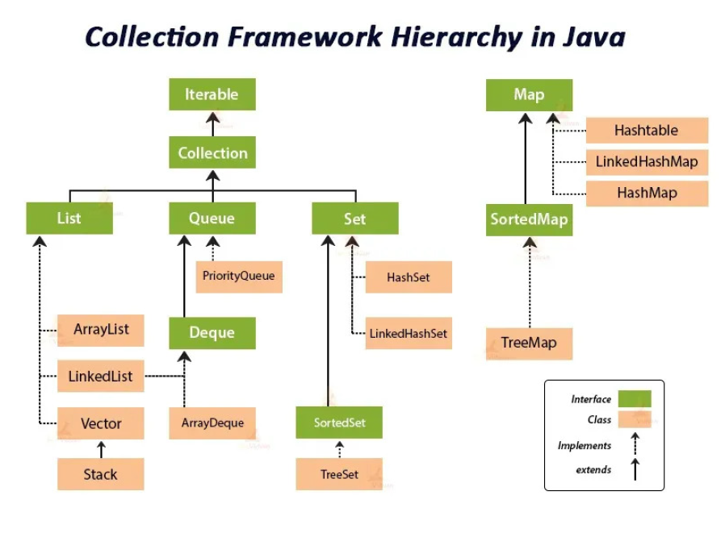

# Programacion Java - Estructuras de datos y jerarquia

Este proyecto es una guia educativa de Java. Incluye ejemplos practicos de tipos de datos, operadores, flujo de control, funciones, arrays y estructuras de datos.

## Objetivo de esta guia

Entender que estructuras de datos ofrece Java, como se relacionan entre si y en que casos conviene usar cada una.

## Jerarquia de estructuras de datos en Java

En Java, la mayoria de estructuras de datos reutilizables estan en el framework de colecciones (`java.util`).



> Nota: para evitar rutas rotas en algunos visores Markdown, se usa `./img.png` en la raiz del proyecto.

```text
Iterable
└── Collection
	├── List
	│   ├── ArrayList
	│   └── LinkedList
	│   ├── Vector (legado)
	│   └── Stack (legado)
	├── Set
	│   ├── HashSet
	│   ├── LinkedHashSet
	│   └── SortedSet
	│       └── TreeSet
	└── Queue
		├── PriorityQueue
		└── Deque
		    └── ArrayDeque

Map (rama separada, NO hereda de Collection)
├── HashMap
├── Hashtable (legado)
├── LinkedHashMap
└── SortedMap
    └── TreeMap
```

## Que representa cada interfaz

- `List`: coleccion ordenada, permite duplicados y acceso por indice.
- `Set`: no permite elementos duplicados.
- `Queue`: modela una cola (FIFO en la mayoria de implementaciones).
- `Map`: almacena pares clave-valor (clave unica).

## Cuando usar cada estructura

- Usa `ArrayList` cuando necesites leer por indice frecuentemente.
- Usa `LinkedList` cuando hagas muchas inserciones/eliminaciones en extremos.
- Usa `HashSet` para validar pertenencia y evitar duplicados rapido.
- Usa `TreeSet` o `TreeMap` cuando necesites datos ordenados.
- Usa `HashMap` para busqueda rapida por clave.

## Clase de ejemplo principal de colecciones

En `src/main/java/com/co/examples/estructurasdedatos/JavaCollections.java` se muestran ejemplos practicos de metodos de `Collections`:

- ordenar (`sort`)
- invertir y mezclar (`reverse`, `shuffle`)
- busqueda (`binarySearch`)
- minimos y maximos (`min`, `max`)
- reemplazo/copia (`fill`, `copy`)
- utilidad de comparacion (`frequency`, `disjoint`)
- listas especiales (`singletonList`, `nCopies`, `unmodifiableList`, `synchronizedList`)

## Otras clases relacionadas del proyecto

- `src/main/java/com/co/examples/arrays/EjemploDeArrays.java`
- `src/main/java/com/co/examples/flujosdecontrol/BucleForEach.java`
- `src/main/java/com/co/examples/funciones/Calculadora.java`

## Requisitos

- Java 17+
- Gradle Wrapper (`gradlew.bat`)

## Compilar y ejecutar ejemplos (Windows PowerShell)

```powershell
Set-Location "C:\Users\lil-a\IdeaProjects\programacion_java"
.\gradlew.bat build
```

```powershell
java -cp build\classes\java\main com.co.examples.estructurasdedatos.JavaCollections
java -cp build\classes\java\main com.co.examples.arrays.EjemploDeArrays
java -cp build\classes\java\main com.co.examples.funciones.Calculadora
```

## Ruta de estudio sugerida

1. Tipos de datos y variables.
2. Operadores.
3. Flujo de control (`for`, `while`, `do-while`, `for-each`).
4. Arrays.
5. Colecciones (`List`, `Set`, `Queue`, `Map`).
6. Aplicacion practica con Swing (`Calculadora`).

